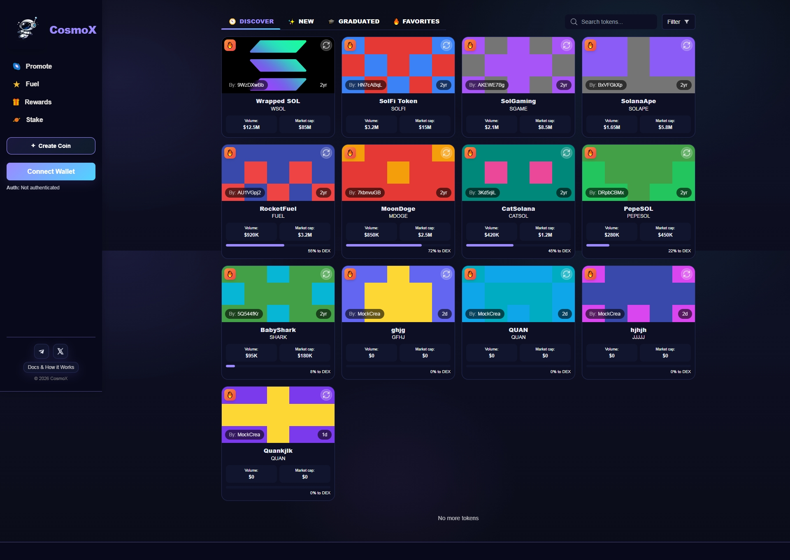
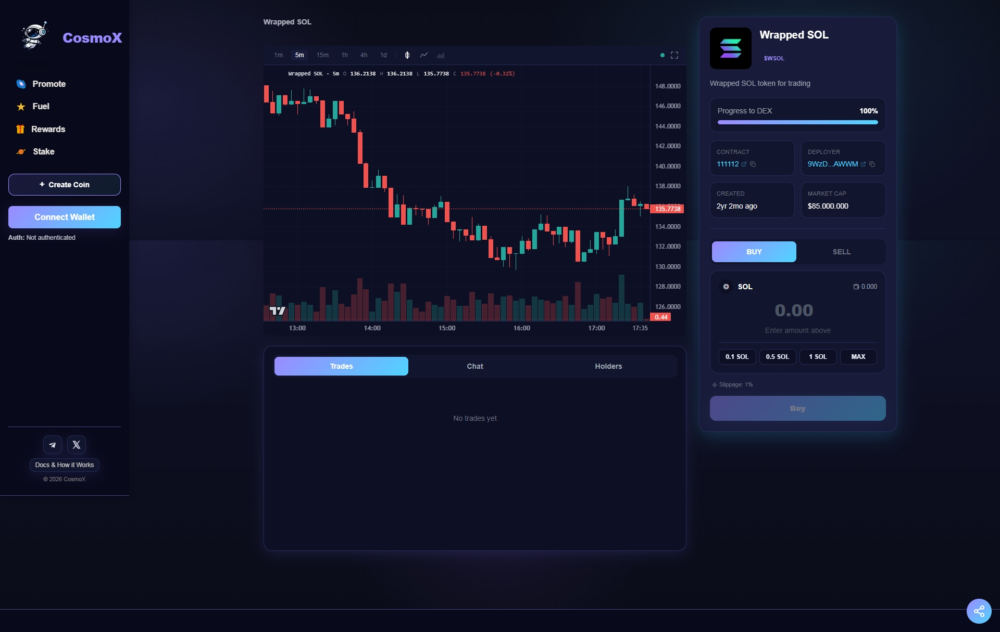
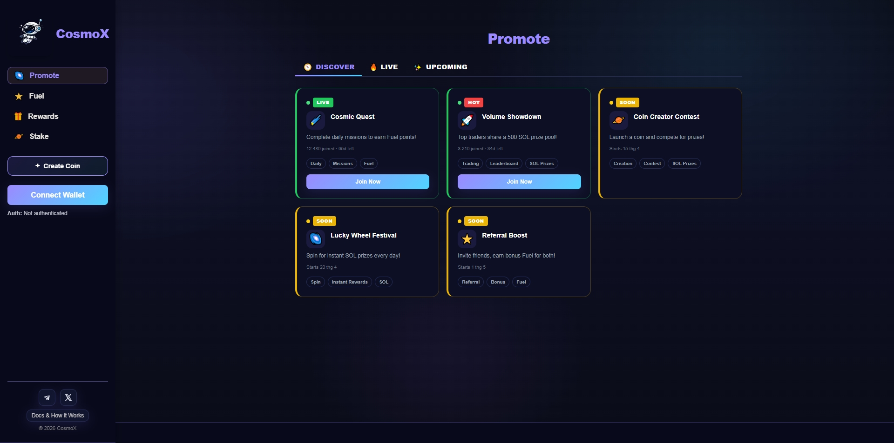
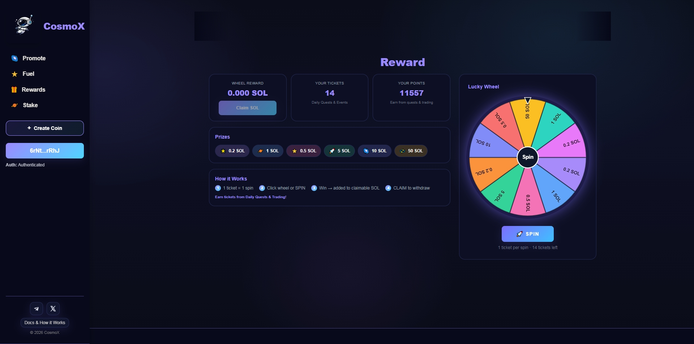
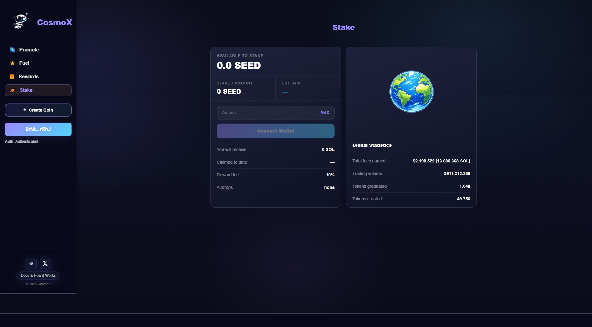
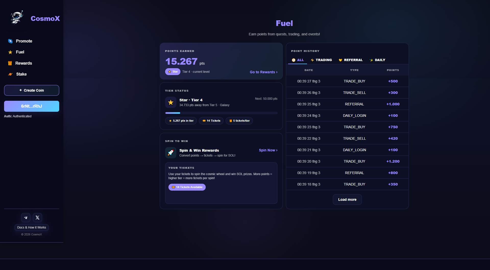
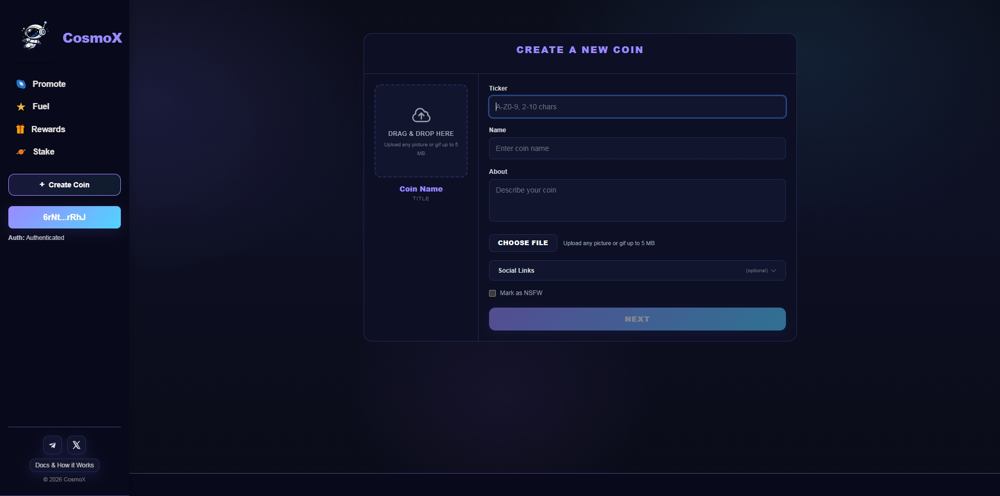

# CosmoX — Solana Token Launchpad & Trading Platform

> A full-featured decentralized token launchpad built on **Solana**, enabling users to create, trade, and track tokens with real-time pricing, on-chain transactions, and community features.

## Demo
https://chain-meme-launchpad-frontend.vercel.app/

### Home Page


### Trading


### Candy Reward


### Sweet Points


### Referrals


### Promote


### Create Token
(docs/screenshots/create-token-2.png)

## Overview

CosmoX is a **Solana-based token launchpad** (similar to Pump.fun), designed as a complete production-ready web application. The platform enables users to:

- **Create custom SPL tokens** with metadata, logos, and social links
- **Trade tokens** via bonding curve mechanics with real-time price charts
- **Track portfolios** with transaction history, holder analytics, and market data
- **Earn rewards** through a gamified points system with Lucky Wheel spins
- **Engage communities** with per-token chat rooms and live activity feeds

## Tech Stack

### Frontend
| Technology | Purpose |
|---|---|
| **Next.js 14** | React framework — SSR, API routes, file-based routing |
| **TypeScript** | Type safety across the entire codebase |
| **Tailwind CSS** | Utility-first styling + CSS custom properties for theming |
| **Framer Motion** | Page transitions and micro-interactions |
| **Headless UI** | Accessible tab components |
| **Lightweight Charts** | High-performance financial charting (TradingView engine) |
| **React Query** | Server state management, caching, auto-refetch |
| **Axios** | HTTP client with interceptors, retry logic, auth headers |

### Blockchain
| Technology | Purpose |
|---|---|
| **@solana/web3.js** | Solana blockchain interaction |
| **@solana/wallet-adapter** | Multi-wallet support (Phantom, Solflare) |
| **VersionedTransaction** | Modern Solana transaction format |
| **SPL Token** | Solana Program Library token standard |

### Backend (Mock API)
| Technology | Purpose |
|---|---|
| **Express.js** | REST API server |
| **UUID** | Idempotency key generation |
| **CORS** | Cross-origin request handling |

### Prerequisites

- **Node.js** >= 20
- **Phantom** or **Solflare** wallet extension

### Installation

```bash
# Install frontend
npm install

# Install mock API
cd mock-api-server && npm install && cd ..
```

### Development

```bash
# Terminal 1 — Mock API (http://localhost:4000)
cd mock-api-server && npm run dev

# Terminal 2 — Frontend (http://localhost:3000)
npm run dev
```

### Production

```bash
npm run build
npm start
```

---

## Environment Variables

Create `.env.local` in the root:

```env
# Solana
NEXT_PUBLIC_SOLANA_RPC_URL=https://api.devnet.solana.com

# Backend API
NEXT_PUBLIC_API_BASE_URL=https://dev.cosmox.app

# WebSocket
NEXT_PUBLIC_WS_BASE_URL=wss://dev.cosmox.app/ws

# Frontend URL
NEXT_PUBLIC_SITE_URL=http://localhost:3000

# Explorer
NEXT_PUBLIC_SOLSCAN_URL=https://solscan.io

# DEX
NEXT_PUBLIC_DEX_SWAP_URL=https://raydium.io/swap
NEXT_PUBLIC_DEX_TARGET=100

# Domain
NEXT_PUBLIC_DOMAIN=cosmox.app
```

